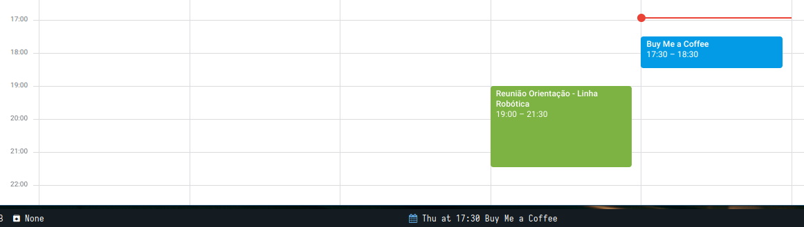

# GooFee is a GoogleFeeds for Polybar 

A simple library to show the google calendar feed on polybar bar.

## Google API
https://developers.google.com/calendar/quickstart/python

1. You need to create a Google API project and download your OAuth 2.0 credentials json file.
You first need to create a project here, then add Google Calendar support, then download the credentials.json file.
2. Download the credentials file to somewhere on your computer.
3. Proceed to installation phase.


## USAGE

In `user_modules.ini` add this code:

```bash
[module/GooFee]
type = custom/script
; Show the next event and forget cache automatically every 60 minutes
;format-prefix = " "
format-prefix = "%{F#61afef}%{F-} " 
exec = cd $GFEED_PATH && python src/getEvent.py -d 5 -o UPDATE
; left click to launch Google Calendar
click-left = brave https://calendar.google.com/calendar
click-right = notify-send --icon=gtk-info GooFee ""
interval = 900
```

Now in `config.ini`:

```bash
modules-center = GooFee
```

after that:



# Contributing
Read our contributing guidelines for how to get started with contributing to GooFee.

## References

- [i3-agenda](Publichttps://github.com/rosenpin/i3-agenda)


